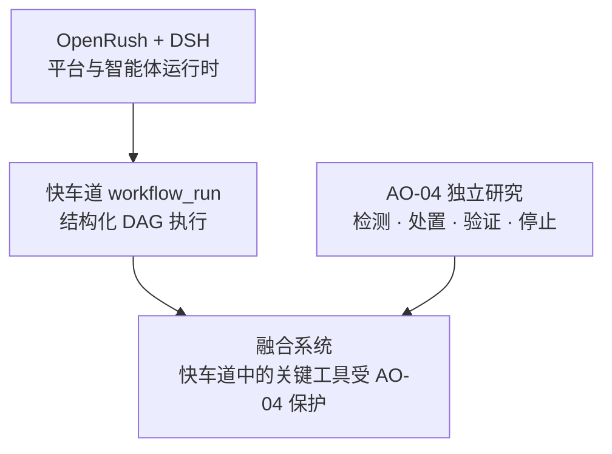
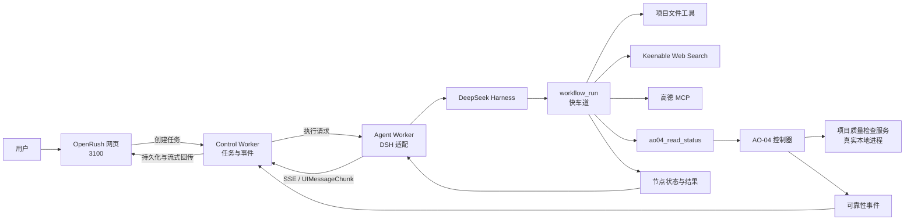
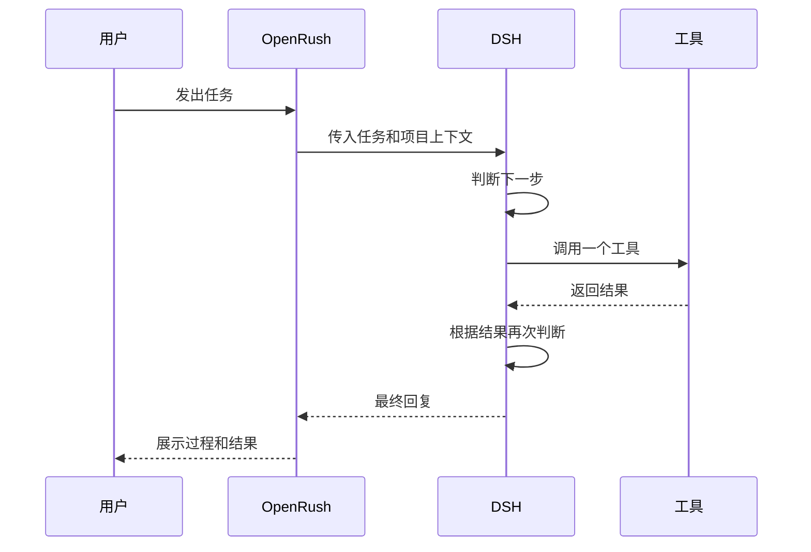
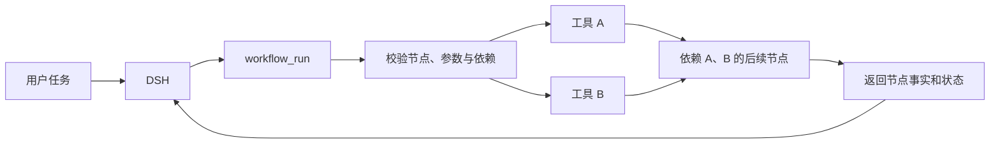
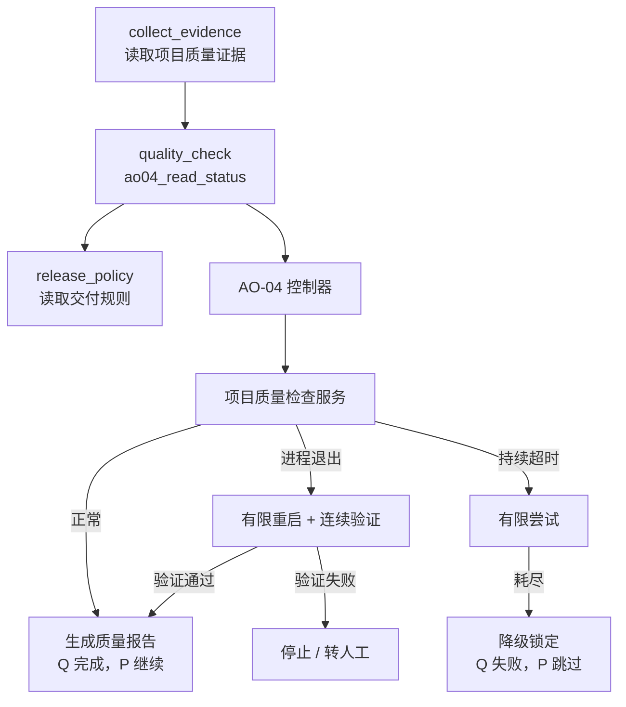
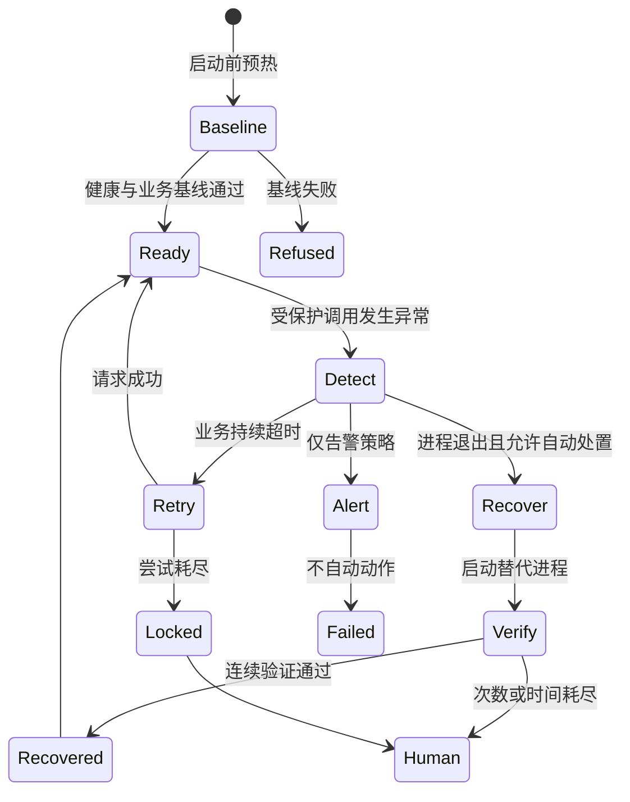

# OpenRush 智能体快车道与 AO-04 可靠性融合项目

## 1. 项目一句话介绍

本项目把 OpenRush 的网页交互平台、DeepSeek Harness 智能体运行时、可视化工作流快车道和 AO-04 安全自愈能力组合在一起，使智能体既能调用搜索、地图和项目文件等工具完成多步骤任务，也能在关键本地依赖发生进程退出或持续超时时，自动恢复或安全停止。

它解决的不是“让模型永远不出错”，而是两个更具体的问题：

1. 如何把智能体的多工具任务从逐步试探，变成可观察、可复现的工作流执行。
2. 工作流依赖的业务服务发生故障时，如何限制自动动作、验证真实恢复，并阻止错误继续扩散。

## 2. 项目由哪四部分组成

我们的实际工作可以分成四层。四层逐步叠加，最终形成完整演示平台。

| 层次 | 工作内容 | 解决的问题 | 展示重点 |
|---|---|---|---|
| 1 | AO-04 独立课题 | 服务故障后怎样安全地检测、处置、验证和停止 | 对照实验、恢复验证、降级、处理单、审批演练 |
| 2 | OpenRush + DSH | 如何在网页平台里运行 DSH 智能体 | 对话、思考、工具调用、结果回传和任务记录 |
| 3 | OpenRush + DSH + 快车道 | 明确的多步骤任务如何按依赖统一执行 | `workflow_run`、实时 DAG、并行节点和节点结果 |
| 4 | OpenRush + DSH + 快车道 + AO-04 | 快车道中的关键业务依赖坏了怎么办 | 真实进程退出恢复、持续超时降级、后置节点门控 |



答辩时可以这样概括：

> AO-04 先独立研究自动修复的安全边界；OpenRush 与 DSH 提供真实智能体平台；快车道把多工具任务变成工作流；最终我们把 AO-04 接入快车道中的关键业务节点，让工作流在依赖故障时能够恢复后继续，或者失败后及时停止。

## 3. 各组件到底是什么

| 组件 | 主要职责 | 通俗理解 |
|---|---|---|
| OpenRush | 项目、对话、任务调度、过程展示和结果保存 | 用户看得见的工作平台 |
| DSH / DeepSeek Harness | 运行模型、组织 agent loop、注册和调用工具 | 智能体运行时 |
| `workflow_run` | 接收或规划结构化工作流，按依赖执行工具 | 快车道入口 |
| 实时 DAG | 显示开始、工具节点、依赖箭头、结束和状态 | 任务执行路线图 |
| Web Search | 通过 Keenable MCP 获取开放网页信息 | 在线资料检索工具 |
| 高德 MCP | 提供地理编码、天气、地点和路线等能力 | 地图与出行工具集 |
| `ao04_read_status` | 快车道中受 AO-04 保护的项目质量检查入口 | 被重点保护的业务工具 |
| AO-04 控制器 | 管理依赖进程、识别故障、执行恢复、验证和记录 | 可靠性控制模块 |
| 质量检查服务 | 读取项目质量证据并生成检查结果的本地 Flask 服务 | 被保护的真实演示依赖 |
| 8766 控制台 | 启动服务、注入退出或超时、展示处置过程 | 答辩操作台 |

最容易混淆的一点是：**快车道不是被故意杀掉的进程。** 快车道是执行工作流的引擎；我们制造故障的是快车道调用的“项目质量检查服务”。AO-04 保护这个业务服务，并把结果返回给快车道。

## 4. 总体架构



### 一次请求的数据流

1. 用户在 OpenRush 输入任务。
2. 平台创建一次任务执行，并交给 Agent Worker。
3. Agent Worker 启动 DSH，把项目目录、系统提示和工具配置注入运行时。
4. DSH 判断是否调用 `workflow_run`。
5. 快车道读取运行时当时真正可用的工具，并生成或接收 DAG。
6. 没有依赖关系的工具节点可以并行；有依赖的节点等待前置结果。
7. 普通文件、搜索和地图工具直接由快车道调用。
8. `ao04_read_status` 通过 AO-04 控制器访问质量检查服务。
9. 工作流节点状态返回 OpenRush，页面渲染 DAG、工具卡片和最终回复。

## 5. 三种 OpenRush 执行方式

### 5.1 OpenRush + DSH：模型逐步决定



特点：灵活，适合探索性任务；模型会在每轮工具返回后决定下一步，不一定出现结构化 DAG。

### 5.2 OpenRush + DSH + 快车道：按图执行



特点：先形成完整步骤，再由执行引擎调度。每个节点仍调用真实工具；互不依赖的节点可以并行。

### 5.3 OpenRush + DSH + 快车道 + AO-04：关键节点受保护



这条链路体现的是：可靠性结果成为工作流控制条件，而不是另开一个互不相干的监控页面。

## 6. 快车道是如何实现的

### 6.1 结构化工作流

快车道使用结构化 DSL 表示工作流。每个节点包含：

- `id`：节点标识。
- `tool`：要调用的工具。
- `input`：工具参数。
- `dependsOn`：必须先完成的节点。

示例：

```json
{
  "version": "1",
  "name": "在线搜索与地图验证",
  "nodes": [
    {
      "id": "search",
      "tool": "mcp__keenable-search__web_search",
      "input": { "query": "杭州近期旅游资讯", "limit": 3 }
    },
    {
      "id": "weather",
      "tool": "mcp__amap-maps__maps_weather",
      "input": { "city": "杭州" }
    }
  ]
}
```

两个节点没有互相依赖，因此可以并行执行。

### 6.2 动态工具注入

快车道没有为每个业务场景写死一组工具。它在运行时读取 DSH 当时注册的工具 schema，并按安全规则筛选可进图工具。

当前可用于快车道的主要只读能力包括：

- 项目文件读取、搜索和列表。
- 已知网页抓取。
- Keenable Web Search。
- 高德地理编码、天气、地点搜索和路线等工具。
- 明确额外允许的 AO-04 受保护工具。

文件写入、编辑、Shell 命令、删除和递归启动工作流等能力不会默认进入快车道。它们仍可由外层智能体按原有权限调用。

### 6.3 工具配置如何进入 DSH

DSH composition 负责组合运行时插件：

1. `openrush-loop-mcp` 读取现有环境变量。
2. 配置高德 Key 时，连接高德官方 MCP。
3. 启动本地 Keenable MCP 适配器，通过配置的 API 访问 Web Search。
4. MCP 插件等待各连接完成首次工具同步，再结束自身初始化。
5. 同一 composition 还挂载 `ao04_read_status` 和 `workflow_run`。
6. `workflow_run` 在每次提示组装和实际执行时重新读取实时工具 schema，因此不会只依赖启动时的一次工具快照。

密钥保存在忽略提交的本地环境文件中，不进入 Git、页面或验收日志。

## 7. AO-04 是如何实现的

AO-04 的核心不是“遇到问题就重启”，而是一个有明确停止条件的控制闭环。



### 7.1 基线门禁

正式任务前先确认受管进程、健康接口和业务接口均稳定。若起点本身不健康，实验拒绝开始，避免把旧故障误算成新故障的恢复结果。

### 7.2 进程退出策略

进程确实退出时，自动模式可以启动新的受管进程。重启动作完成后不会立即宣布成功，而是连续检查：

- 健康接口是否通过。
- 真实业务请求是否通过。
- 当前响应是否属于新启动的受管实例。

三项连续满足后才确认恢复。PID 变化只是辅助证据，不是唯一恢复标准。

### 7.3 持续超时策略

进程仍存在但业务持续超时时，当前策略不会盲目重启进程，而是执行有限次数的只读业务尝试。达到上限后进入降级锁定，后续调用不再持续撞击故障依赖。

### 7.4 假完成与高风险动作

- 工具声称完成但产物不存在：独立检查产物，判定失败并转人工。
- 修改重要配置：没有审批时拒绝；演示审批通过后也只执行 dry-run，并检查配置前后哈希没有改变。

### 7.5 取消与并发隔离

平台内部为每次执行携带 Run 身份和租约代次。它们不会暴露给演示操作者，但用于防止旧任务的迟到取消误伤新任务，也避免同一受管服务被互相覆盖。

## 8. 页面上分别能看到什么

### 8.1 OpenRush 页面：3100

| 区域 | 展示内容 | 答辩时看什么 |
|---|---|---|
| 对话区 | 用户请求、模型思考、工具卡片和最终回复 | 是否真实调用工具，结果是否进入回复 |
| Workflow | 当前和历史快车道 DAG | 节点、箭头、并行关系、完成/失败/跳过状态 |
| 可靠性 | AO-04 事件时间线 | 故障发现、动作、验证和终态 |
| Files | 当前项目工作区文件 | 输入证据与交付规则是否来自真实项目文件 |

一个对话里多次调用快车道时，Workflow 面板会显示“第 1 次、第 2 次……”的运行记录。每次运行保留自己的图和状态，不会被后一轮覆盖。

这里的“实时 DAG”指页面会随运行过程接收工作流工具状态，并在结果返回后写入每个节点的最终状态。显式 DSL 可以先显示待执行图；不同工具运行时对内部节点事件的流式粒度不同，因此不能把它理解成所有场景都会逐毫秒推送每一个节点变化。

### 8.2 AO-04 控制台：8766

| 区域 | 展示内容 |
|---|---|
| 服务状态 | 进程运行/退出、业务可用/超时、保护状态 |
| 服务代次 / PID | 真实受管进程是否发生替换 |
| 架构关系 | OpenRush、快车道、AO-04 和质量服务的调用关系 |
| 故障按钮 | 模拟真实进程退出、持续超时或重置演示 |
| 实时处置摘要 | 故障是否已生效、当前是否恢复或降级 |
| 事件列表 | detected、action、verify、terminal 等原始证据 |

8766 不是 OpenRush，也不控制 3100 的进程。它只负责 AO-04 演示业务服务与故障注入；3100 是用户发任务和查看 DAG 的平台。

### 8.3 AO-04 独立研究平台：8765

8765 用于展示 AO-04 单独课题，包括更完整的实验矩阵、策略对照、处理单、假完成和审批演练。8766 则用于展示 AO-04 如何进入 OpenRush 的真实工具链路。

## 9. 推荐答辩演示顺序

建议控制在 8 到 12 分钟。

### 第一段：说明四层关系

用本文第 2 节的关系图说明：AO-04 是独立研究，OpenRush + DSH 是平台基础，快车道是执行扩展，最后一层是融合验证。

### 第二段：展示普通快车道

在 OpenRush 发送：

> 用快车道查询杭州明天的天气，并搜索杭州近期值得关注的旅游资讯，整理成一份简短出行建议。

观察：

- 对话中出现 `workflow_run` 工具卡片。
- Workflow 面板出现搜索与高德节点。
- 没有依赖的节点并行排列。
- 两个节点完成后，模型基于真实结果总结。

这一段证明快车道不是 AO-04 专用流程，它本身可以复用运行时动态注入的工具。

### 第三段：展示 AO-04 健康路径

1. 打开 8766，点击“重置演示”。
2. 确认进程“运行中”、接口“可用”、保护状态“空闲”。
3. 点击“复制项目检查任务”，粘贴到 OpenRush 并发送。
4. 查看 Workflow：`collect_evidence → quality_check → release_policy` 全部完成。
5. 在 `quality_check` 节点输出中查看质量报告产物信息，再看模型给出的最终交付建议。

### 第四段：展示进程退出自动恢复

1. 回到 8766，记住当前 PID。
2. 点击“模拟进程退出”，确认进程显示“已退出”。
3. 回到 OpenRush，再发送同一项目质量检查任务。
4. 8766 应出现：发现故障 → 执行恢复动作 → 三次恢复验证 → 恢复完成。
5. PID 应发生变化，业务恢复为“可用”。
6. OpenRush Workflow 中受保护节点完成，后置交付规则继续执行。

讲解口径：

> 我们先让关键质量检查服务的真实进程退出。工作流调用受保护节点时，AO-04 发现进程不可达，启动替代进程，并连续验证健康、业务和实例归属。只有验证通过后，后置节点才继续。

### 第五段：展示持续超时安全停止

1. 在 8766 点击“重置演示”。
2. 点击“模拟持续超时”。
3. 在 OpenRush 再发项目质量检查任务。
4. 8766 显示有限尝试后“已降级”或“锁定”。
5. OpenRush Workflow 中 `quality_check` 失败，`release_policy` 显示“跳过”。

讲解口径：

> 超时不等于进程退出，因此系统没有盲目重启。有限尝试仍失败后，AO-04 锁定故障依赖，工作流阻止依赖它的后置步骤，避免把不可靠结果继续传下去。

### 第六段：补充独立研究

切到 8765，用较短时间展示仅告警对照、假完成、处理单和审批 dry-run，说明 AO-04 的研究范围比融合 Demo 更完整。

## 10. 可直接使用的测试提示词

### 普通在线工具任务

```text
用快车道查询杭州明天的天气，并搜索杭州近期值得关注的旅游资讯，整理成一份简短出行建议。
```

### 明确验证 Web Search 与高德并行执行

```text
立即调用 workflow_run 验证在线工具，严格使用完整 DSL：
dsl={"version":"1","name":"在线搜索与地图验证","nodes":[{"id":"search","tool":"mcp__keenable-search__web_search","input":{"query":"OpenAI official website","limit":3}},{"id":"geo","tool":"mcp__amap-maps__maps_geo","input":{"address":"杭州市西湖区"}}]}
执行后分别报告搜索结果和地理编码结果。
```

### AO-04 项目质量检查

答辩时优先使用 8766 页面上的“复制项目检查任务”，避免手写 DSL 出错。需要手动复现时使用下面的完整提示词：

```text
立即调用 workflow_run 执行项目交付质量检查，不修改文件。完成后报告测试、构建、阻断项、质量报告产物、最终交付建议和 AO-04 恢复情况。

调用 workflow_run，使用完整 DSL：
dsl={"version":"1","name":"项目交付质量检查","nodes":[{"id":"collect_evidence","tool":"read","input":{"file_path":"m3/project-delivery-input.json"}},{"id":"quality_check","tool":"ao04_read_status","dependsOn":["collect_evidence"],"input":{"query":"{{nodes.collect_evidence.output.lines.0.text}}"}},{"id":"release_policy","tool":"read","dependsOn":["quality_check"],"input":{"file_path":"m3/delivery-policy.txt"}}]}
```

## 11. 当前已经验证的能力

| 能力 | 当前状态 | 验证方式 |
|---|---|---|
| OpenRush 调用真实 DSH | 已完成 | 页面真实对话与工具事件 |
| 普通项目工作区隔离 | 已完成 | 工具只读取对应项目目录 |
| 多次快车道不互相覆盖 | 已完成 | Workflow 运行记录可切换 |
| DAG 箭头与节点状态 | 已完成 | 开始、依赖箭头、结束、失败与跳过均可见 |
| 工具卡片视觉统一 | 已完成 | 与思考和对话区域一致展示 |
| Keenable Web Search | 已完成 | 真实 MCP 注册和在线调用 |
| 高德 MCP | 已完成 | 15 个工具注册，真实地理编码调用 |
| 搜索与高德并行 DAG | 已完成 | OpenRush 页面显示 2/2 节点完成 |
| AO-04 健康调用 | 已完成 | 质量检查成功并生成业务结果 |
| 真实进程退出恢复 | 已完成 | PID 更换、三次验证、后置节点继续 |
| 持续超时降级锁定 | 已完成 | 有限尝试后锁定，后置节点跳过 |
| 假完成产物检查 | 已实现 | 缺产物时转人工 |
| 仅告警策略 | 已实现 | 一次失败，不自动处置 |
| 取消与旧 Run 隔离 | 已实现 | 迟到取消不会影响新执行 |
| 高风险配置审批演练 | 已完成 | 无审批拒绝，有模拟审批也只 dry-run |

## 12. 当前能力边界

答辩时应主动说明以下限制：

1. AO-04 当前保护的是明确接入的项目质量检查工具，不是自动保护 OpenRush 的所有工具。
2. Web Search、高德和普通文件读取已经进入快车道，但没有自动获得 AO-04 的重启与降级策略。
3. 质量检查服务是本地真实进程和真实 HTTP 接口，但仍是实验业务，不代表已经接入生产系统。
4. 进程退出可以通过重启验证恢复；持续超时当前选择有限尝试后降级，不宣称服务已经恢复。
5. 自动恢复成功率只适用于受控实验条件，不能外推为未知生产故障的成功率。
6. 高风险配置变更只做审批与 dry-run 演练，没有真正修改生产配置。
7. 快车道适合步骤和依赖较明确的任务；探索性强、需要不断追问的任务仍适合普通 agent loop。
8. 在线搜索和地图演示依赖网络及本地密钥配置，答辩前应提前完成一次健康检查。

## 13. 项目带来的启发

### 13.1 可靠性能力应进入执行链路

可靠性模块如果只在外部监控面板告警，无法直接控制当前工作流是否继续。本项目把 AO-04 结果变成节点状态，使恢复、降级和转人工真正影响后续执行。

### 13.2 自动修复必须以验证为结束条件

“执行了重启命令”不等于“业务恢复”。恢复判断应包含健康、业务正确性、产物和实例归属等独立证据。

### 13.3 工具注入应由运行时决定

快车道从 DSH 实时工具目录获取能力。加入新的安全只读 MCP 后，不需要为每个场景重新实现一套工作流引擎。这比把工具列表写死在 Demo 里更接近可复用模块。

### 13.4 工作流展示也是可解释性的一部分

DAG、节点结果和可靠性事件让答辩者能够回答：调用了什么、为什么等待、哪里失败、为什么继续或停止。它们不是装饰，而是执行证据的可视化入口。

## 14. 答辩结论

本项目形成了两个相互支撑的成果：

- AO-04 独立课题证明了在明确边界内进行故障检测、有界处置、恢复验证、安全停止和审计记录的方法。
- OpenRush 融合平台证明了这些可靠性策略可以进入真实智能体工具调用链路，与 DSH、快车道、项目文件、Web Search 和高德 MCP 一起工作。

最终展示的重点不是“系统能够修复任何问题”，而是：**面对已定义的关键依赖故障，系统知道什么时候可以自动做、如何证明做对了，以及什么时候必须停止。**

## 15. 答辩 QA 知识库

下面的问题按老师最可能的追问顺序整理。回答时先给结论，再补实现细节，不要一上来背代码名称。

### 15.1 项目整体

**问：你们这个项目到底做了什么？**

答：我们完成了四层工作。第一层是 AO-04 自动修复与安全自愈研究；第二层是把 DSH 接入 OpenRush；第三层是开发可以按 DAG 执行多工具任务的快车道；第四层是让 AO-04 保护快车道中的一个关键业务节点。最终效果是，依赖恢复后工作流继续，依赖持续失败时工作流安全停止。

**问：这四部分是一个课题还是四个项目？**

答：它们是按需求逐步形成的一条演进路线。AO-04 可以独立作为课题验收，OpenRush + DSH 和快车道可以独立运行，最后再通过受保护工具把它们连接起来。

**问：你们解决的是模型不可靠吗？**

答：不是直接纠正模型输出。我们保护的是智能体调用的一个本地业务依赖，重点是依赖进程退出、业务超时、恢复验证和后续工作流门控。

**问：为什么要做这四层？**

答：单独的 AO-04 只能证明控制器会正确处置故障；单独的快车道只能证明流程会按图执行。把两者结合，才能证明可靠性结果真的会影响智能体任务是否继续。

### 15.2 AO-04 独立课题

**问：AO-04 的核心创新是什么？**

答：核心是把自动修复变成一个有界闭环。系统先观察真实状态，再决定动作，动作后验证健康、业务和实例归属，最后根据预算决定恢复、降级或转人工。它不把“执行了重启”直接等同于“业务恢复”。

**问：为什么进程退出可以重启？**

答：因为退出状态明确，重启对象是我们管理的受管进程，动作范围可控，且可以通过新进程的健康、业务和归属验证确认结果。当前结论只适用于这类明确边界的低风险动作。

**问：为什么超时不直接重启？**

答：超时只能说明业务请求没有按时完成，不能证明进程已经退出。直接重启可能误伤仍在处理的服务，因此当前策略采用有限业务尝试，达到上限后降级锁定。

**问：三次验证是什么意思？**

答：恢复后连续三次检查都要满足健康通过、业务通过、实例归属正确。三次是为了避免一次偶然成功或短暂抖动被误判为恢复。

**问：三次尝试是三次模型调用吗？**

答：不是。它们发生在一次受保护工具调用内部，由 AO-04 控制器执行；模型只收到最终的成功、失败或降级结果。

**问：240 次实验能证明生产环境可靠吗？**

答：不能。240 次证明的是在预先定义的本地条件下，系统能稳定执行规定的检测、处置、验证和停止。未知故障、生产流量和更复杂的依赖仍需要单独验证。

**问：20/20 是不是所有进程退出都能恢复？**

答：不是。20/20 特指“进程退出 + 自动处置 + 受控恢复动作”这一组条件。仅告警、执行器故障、健康抖动等场景有不同结果，不能混在一起计算。

**问：降级算修复成功吗？**

答：不算。降级表示系统停止继续冲击故障依赖，并把影响控制在边界内。它是正确的安全处置，但依赖本身仍然没有恢复。

**问：这算回滚吗？**

答：不是内存回滚，也不撤销已经发生的业务副作用。这里的回退是停止自动动作、隔离故障、降级服务并转交人工。

**问：高风险配置变更真的执行了吗？**

答：没有。无审批时直接拒绝；模拟审批通过时只生成 dry-run 计划，并比较前后配置哈希，确保配置没有被实际修改。

### 15.3 OpenRush 与 DSH

**问：OpenRush 和 DSH 谁负责什么？**

答：OpenRush 负责网页、项目、任务、事件保存和结果展示；DSH 负责运行模型、组织 agent loop 和调用工具。我们完成的是平台侧适配，没有把 DSH 说成自研模型或自研运行时。

**问：你们改 DSH 源码了吗？**

答：没有。OpenRush 通过运行时启动方式、环境变量、项目工作区和事件适配接入 DSH，DSH 仍按自己的 JSON-RPC 和工具机制运行。

**问：网页里看到的工具调用是真实的吗？**

答：是。页面请求会进入 Agent Worker，再启动 DSH；工具开始、工具结果和最终回复都通过事件流返回。验证时我们看的是实际 tool-call/result，而不是只看模型复述。

**问：为什么要有 Agent Worker 和 Control Worker 两层？**

答：Control Worker 负责任务编排和生命周期，Agent Worker 负责具体模型与工具执行。这样网页、调度和执行环境职责分开，取消、断线恢复和事件保存也有明确位置。

**问：Run、Session 和 PID 是什么关系？**

答：Run 是平台里一次任务执行；Session 是 DSH 对话上下文；PID 是操作系统中某个受管进程的编号。演示者不需要手动填写这些身份，后台会用它们保证任务和服务互不误伤。

### 15.4 快车道与 DAG

**问：快车道和普通 Agent Loop 有什么区别？**

答：普通 Agent Loop 是模型做一步、看结果、再决定下一步；快车道先形成节点和依赖关系，再由执行引擎调度。普通模式更灵活，快车道更适合步骤明确、可以并行或有固定依赖的任务。

**问：快车道是不是只调用一次模型？**

答：不是。模型可以参与工作流生成和最终总结；节点执行和依赖调度由引擎负责。我们只说减少不必要的逐步决策，不宣称整个任务只有一次模型调用。

**问：DAG 上的箭头代表什么？**

答：箭头表示节点依赖关系，不是网络连接。例如搜索和天气没有依赖，可以并行；汇总节点依赖它们的结果，所以要等两者完成。

**问：为什么要用 DSL？**

答：DSL 把节点、工具、输入和依赖写清楚，执行前可以检查重复 ID、缺失依赖、循环和工具是否存在，也方便稳定复现演示结果。

**问：一个对话里多次调用快车道会不会覆盖？**

答：不会。页面为每次调用保存独立的运行记录和工具调用标识，Workflow 面板可以在第 1 次、第 2 次之间切换，每张图有自己的节点状态和箭头。

**问：哪些工具能进入快车道？**

答：当前主要是安全只读工具，包括项目文件读取、已知网页抓取、Keenable Web Search、高德 MCP，以及明确额外允许的 AO-04 受保护工具。写文件、编辑、Shell、删除和递归启动工作流不会默认进入图。

**问：工具是写死的吗？**

答：工具来自 DSH 运行时动态注入的 schema。快车道在提示组装和执行时读取当时可用的工具，再按安全策略筛选。这样增加一个安全只读 MCP 时，不需要为每个场景重写引擎。

### 15.5 AO-04 融合

**问：AO-04 到底保护了什么？**

答：保护的是“项目质量检查”这个业务节点背后的本地质量检查服务。它不是保护快车道进程本身，也不是自动修复 OpenRush、DSH 或数据库。

**问：融合后的实际链路是什么？**

答：用户在 OpenRush 发起项目交付检查，DSH 调用 `workflow_run`；工作流先读取项目质量证据，再通过 `ao04_read_status` 调用 AO-04 控制器；控制器访问质量检查服务并返回结果；只有质量检查成功，后面的交付规则节点才会执行。

**问：8766 在主链路里吗？**

答：8766 是演示控制台，不是任务执行主链路。它负责启动服务、制造进程退出或超时，并展示 AO-04 事件。真正的任务从 3100 发出，经过 DSH、快车道和受保护工具。

**问：8765、8766、3100 分别是什么？**

答：8765 展示 AO-04 独立课题；8766 控制融合演示中的受保护质量检查服务；3100 是 OpenRush，负责发任务、显示工具卡片、DAG 和最终回复。

**问：为什么质量检查失败后要跳过后置节点？**

答：后置节点依赖质量检查结果。如果关键检查没有成功，继续读取交付规则会把不可靠结果传下去，所以工作流把后置节点明确标为 skipped。

**问：恢复成功能单独证明后置节点执行了吗？**

答：不能。8766 只能证明控制器恢复了服务；后置节点是否执行，要以 3100 Workflow 中的节点状态和工具结果为准。

**问：旧 Run 的取消会不会影响新 Run？**

答：不会。后台为受保护调用携带当前任务身份和租约代次，控制器和工具都会校验。旧任务迟到的取消、返回或释放请求会被拒绝。

### 15.6 Web Search 与高德

**问：搜索和高德为什么也要放进这个项目？**

答：它们用来证明快车道是通用执行能力，不是只为 AO-04 的固定流程写的。搜索与天气等没有依赖的节点可以并行，再由后续节点汇总。

**问：Web Search 用的是什么？**

答：使用 Keenable MCP 适配器，工具名是 `mcp__keenable-search__web_search`。它和 DSH 原生 `web_search` 是不同入口，当前配置避免把不匹配的搜索网关直接交给 DSH 原生接口。

**问：高德有哪些能力？**

答：当前已经接入地理编码、天气、地点搜索、路线、距离和逆地理编码等工具。工具只有在配置高德 Key 且 MCP 连接成功时才会出现在运行时目录中。

**问：搜索或高德现场失败怎么办？**

答：这两项依赖公网和 Key，不作为 AO-04 主演示的唯一证据。现场优先演示进程退出恢复；网络正常时再演示搜索和高德，网络不稳定时使用预先截图并如实说明。

### 15.7 演示操作

**问：现场应该先打开哪些页面？**

答：先打开 8765 看独立课题概览，再打开 8766 和 3100 做融合演示。8766 先点重置并等待基线通过，3100 使用新的对话会话发送任务。

**问：进程退出怎么演示？**

答：在 8766 点击“模拟进程退出”，确认服务变为已退出；回到 3100 发项目质量检查任务；观察 8766 出现发现故障、恢复动作、三次验证和恢复完成，再看 3100 的质量检查节点完成、后置规则节点继续。

**问：持续超时怎么演示？**

答：在 8766 重置后点击“模拟持续超时”，再发同一质量检查任务。预期是三次业务尝试后降级锁定，3100 中质量检查失败，交付规则节点跳过。

**问：页面看到什么才算演示成功？**

答：必须同时核对两边。8766 证明故障和 AO-04 处置过程，3100 证明受保护节点和后置节点状态。只看到模型说“恢复成功”不算充分证据。

**问：为什么打开页面后没有数据？**

答：8765 需要读取本地冻结实验结果；8766 需要先启动受保护服务并完成基线；3100 需要进入有项目和 Agent 配置的演示会话。三个入口职责不同，不能用一个页面替代另一个页面。

### 15.8 诚实边界

**问：你们是不是实现了通用自愈？**

答：还没有。当前只保护一个明确接入、可观测、可重启的本地质量检查服务。通用化需要为每种依赖定义健康检查、业务验证、恢复动作、权限和停止条件。

**问：系统能修复 OpenRush 自己吗？**

答：当前不能。AO-04 的保护对象是质量检查服务，不包含 OpenRush、DSH、数据库和所有 MCP 服务。

**问：快车道一定比普通 Agent Loop 快吗？**

答：不能直接这样说。快车道减少的是明确任务中的重复决策；性能收益需要在相同任务、相同模型和相同环境下做专门对照。

**问：本地服务是不是假数据？**

答：它是我们为实验构建的业务服务，但进程和 HTTP 调用是真实的。故障按钮会作用于真实受管进程，控制器也会通过真实健康和业务接口验证恢复。

**问：你们的实验结果有没有夸大？**

答：没有。我们把完整恢复、降级、拒绝、dry-run 和人工处理分开统计，也明确说明本地小样本不能代表生产环境风险为零。

## 16. 一分钟极简回答

如果答辩时间很紧，可以用下面这段总结：

> 我们先独立完成 AO-04，研究服务故障后什么时候可以自动处理、怎么证明恢复、什么时候必须停止。随后我们把 DSH 接入 OpenRush，并开发快车道，让明确的多工具任务按 DAG 执行。最后，我们把项目质量检查作为一个受保护节点接入快车道。进程退出时，AO-04 可以有限重启并连续验证，验证通过后工作流继续；持续超时时，系统尝试三次后降级锁定，后置节点跳过。8765 展示独立研究，8766 控制融合故障，3100 展示 OpenRush 的真实工作流结果。
