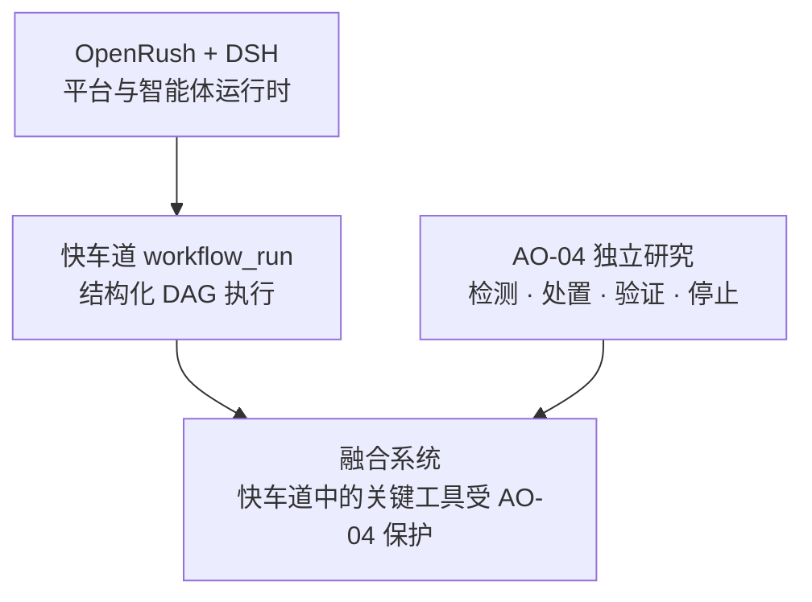
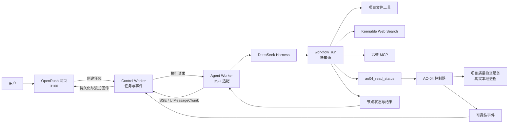
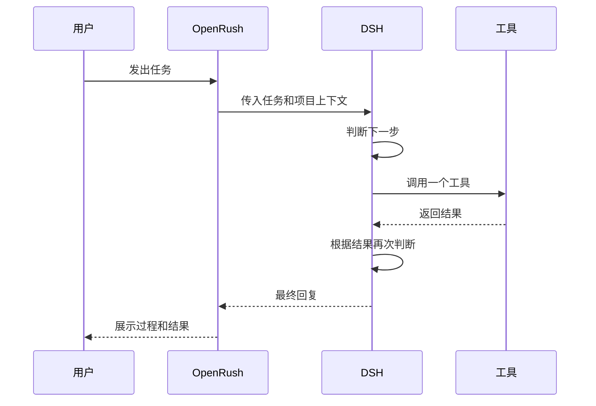
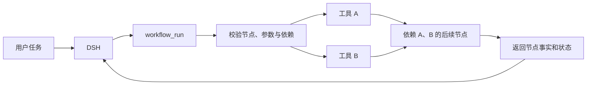
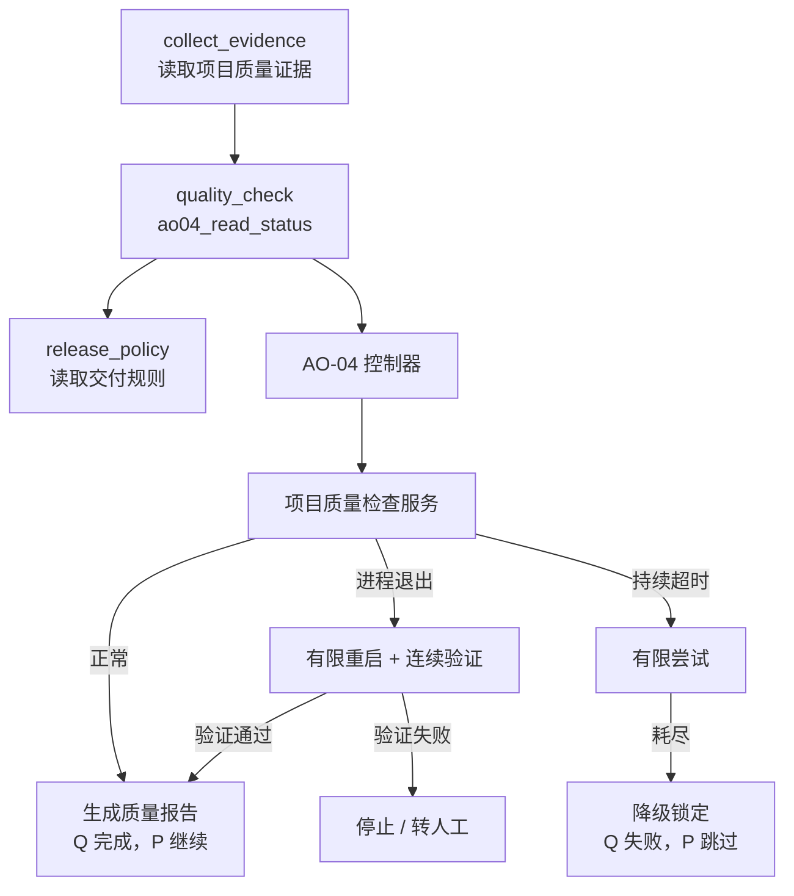
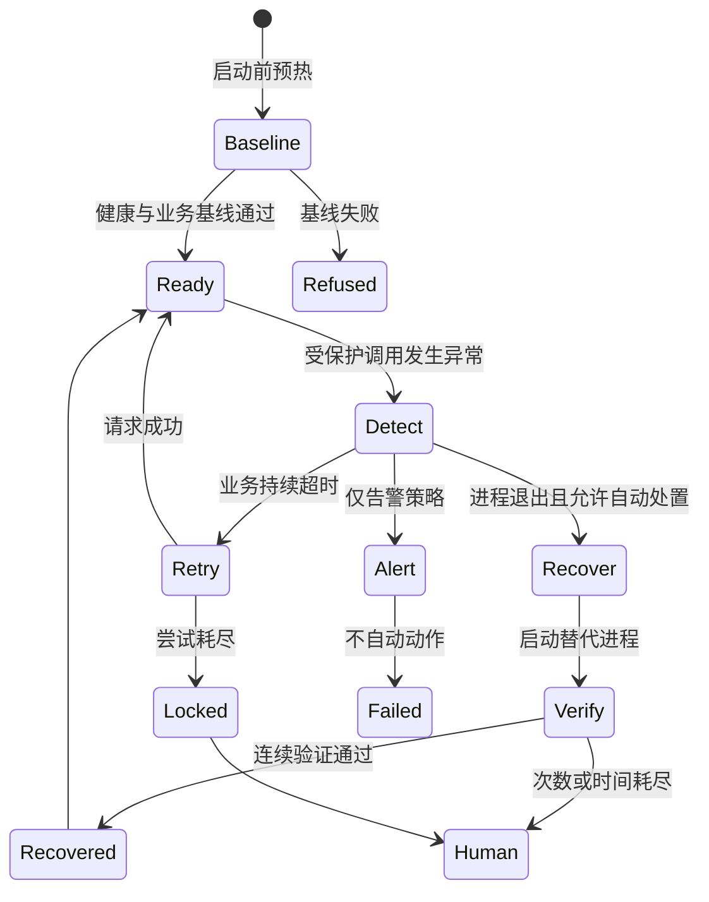

# OpenRush 智能体快车道与 AO-04 可靠性融合项目

## 1. 项目一句话介绍

本项目把 OpenRush 的网页交互平台、DeepSeek Harness 智能体运行时、可视化工作流快车道和 AO-04 安全自愈能力组合在一起，使智能体既能调用搜索、地图和项目文件等工具完成多步骤任务，也能在关键本地依赖发生进程退出或持续超时时，自动恢复或安全停止。

它解决的不是“让模型永远不出错”，而是两个更具体的问题：

1. 如何把智能体的多工具任务从逐步试探，变成可观察、可复现的工作流执行。
2. 工作流依赖的业务服务发生故障时，如何限制自动动作、验证真实恢复，并阻止错误继续扩散。

## 2. 项目由哪四部分组成

我们的实际工作可以分成四层。四层逐步叠加，最终形成完整演示平台。

| 层次 | 工作内容 | 解决的问题 | 展示重点 |
|---|---|---|---|
| 1 | AO-04 独立课题 | 服务故障后怎样安全地检测、处置、验证和停止 | 对照实验、恢复验证、降级、处理单、审批演练 |
| 2 | OpenRush + DSH | 如何在网页平台里运行 DSH 智能体 | 对话、思考、工具调用、结果回传和任务记录 |
| 3 | OpenRush + DSH + 快车道 | 明确的多步骤任务如何按依赖统一执行 | `workflow_run`、实时 DAG、并行节点和节点结果 |
| 4 | OpenRush + DSH + 快车道 + AO-04 | 快车道中的关键业务依赖坏了怎么办 | 真实进程退出恢复、持续超时降级、后置节点门控 |



答辩时可以这样概括：

> AO-04 先独立研究自动修复的安全边界；OpenRush 与 DSH 提供真实智能体平台；快车道把多工具任务变成工作流；最终我们把 AO-04 接入快车道中的关键业务节点，让工作流在依赖故障时能够恢复后继续，或者失败后及时停止。

## 3. 各组件到底是什么

| 组件 | 主要职责 | 通俗理解 |
|---|---|---|
| OpenRush | 项目、对话、任务调度、过程展示和结果保存 | 用户看得见的工作平台 |
| DSH / DeepSeek Harness | 运行模型、组织 agent loop、注册和调用工具 | 智能体运行时 |
| `workflow_run` | 接收或规划结构化工作流，按依赖执行工具 | 快车道入口 |
| 实时 DAG | 显示开始、工具节点、依赖箭头、结束和状态 | 任务执行路线图 |
| Web Search | 通过 Keenable MCP 获取开放网页信息 | 在线资料检索工具 |
| 高德 MCP | 提供地理编码、天气、地点和路线等能力 | 地图与出行工具集 |
| `ao04_read_status` | 快车道中受 AO-04 保护的项目质量检查入口 | 被重点保护的业务工具 |
| AO-04 控制器 | 管理依赖进程、识别故障、执行恢复、验证和记录 | 可靠性控制模块 |
| 质量检查服务 | 读取项目质量证据并生成检查结果的本地 Flask 服务 | 被保护的真实演示依赖 |
| 8766 控制台 | 启动服务、注入退出或超时、展示处置过程 | 答辩操作台 |

最容易混淆的一点是：**快车道不是被故意杀掉的进程。** 快车道是执行工作流的引擎；我们制造故障的是快车道调用的“项目质量检查服务”。AO-04 保护这个业务服务，并把结果返回给快车道。

## 4. 总体架构



### 一次请求的数据流

1. 用户在 OpenRush 输入任务。
2. 平台创建一次任务执行，并交给 Agent Worker。
3. Agent Worker 启动 DSH，把项目目录、系统提示和工具配置注入运行时。
4. DSH 判断是否调用 `workflow_run`。
5. 快车道读取运行时当时真正可用的工具，并生成或接收 DAG。
6. 没有依赖关系的工具节点可以并行；有依赖的节点等待前置结果。
7. 普通文件、搜索和地图工具直接由快车道调用。
8. `ao04_read_status` 通过 AO-04 控制器访问质量检查服务。
9. 工作流节点状态返回 OpenRush，页面渲染 DAG、工具卡片和最终回复。

## 5. 三种 OpenRush 执行方式

### 5.1 OpenRush + DSH：模型逐步决定



特点：灵活，适合探索性任务；模型会在每轮工具返回后决定下一步，不一定出现结构化 DAG。

### 5.2 OpenRush + DSH + 快车道：按图执行



特点：先形成完整步骤，再由执行引擎调度。每个节点仍调用真实工具；互不依赖的节点可以并行。

### 5.3 OpenRush + DSH + 快车道 + AO-04：关键节点受保护



这条链路体现的是：可靠性结果成为工作流控制条件，而不是另开一个互不相干的监控页面。

## 6. 快车道是如何实现的

### 6.1 结构化工作流

快车道使用结构化 DSL 表示工作流。每个节点包含：

- `id`：节点标识。
- `tool`：要调用的工具。
- `input`：工具参数。
- `dependsOn`：必须先完成的节点。

示例：

```json
{
  "version": "1",
  "name": "在线搜索与地图验证",
  "nodes": [
    {
      "id": "search",
      "tool": "mcp__keenable-search__web_search",
      "input": { "query": "杭州近期旅游资讯", "limit": 3 }
    },
    {
      "id": "weather",
      "tool": "mcp__amap-maps__maps_weather",
      "input": { "city": "杭州" }
    }
  ]
}
```

两个节点没有互相依赖，因此可以并行执行。

### 6.2 动态工具注入

快车道没有为每个业务场景写死一组工具。它在运行时读取 DSH 当时注册的工具 schema，并按安全规则筛选可进图工具。

当前可用于快车道的主要只读能力包括：

- 项目文件读取、搜索和列表。
- 已知网页抓取。
- Keenable Web Search。
- 高德地理编码、天气、地点搜索和路线等工具。
- 明确额外允许的 AO-04 受保护工具。

文件写入、编辑、Shell 命令、删除和递归启动工作流等能力不会默认进入快车道。它们仍可由外层智能体按原有权限调用。

### 6.3 工具配置如何进入 DSH

DSH composition 负责组合运行时插件：

1. `openrush-loop-mcp` 读取现有环境变量。
2. 配置高德 Key 时，连接高德官方 MCP。
3. 启动本地 Keenable MCP 适配器，通过配置的 API 访问 Web Search。
4. MCP 插件等待各连接完成首次工具同步，再结束自身初始化。
5. 同一 composition 还挂载 `ao04_read_status` 和 `workflow_run`。
6. `workflow_run` 在每次提示组装和实际执行时重新读取实时工具 schema，因此不会只依赖启动时的一次工具快照。

密钥保存在忽略提交的本地环境文件中，不进入 Git、页面或验收日志。

## 7. AO-04 是如何实现的

AO-04 的核心不是“遇到问题就重启”，而是一个有明确停止条件的控制闭环。



### 7.1 基线门禁

正式任务前先确认受管进程、健康接口和业务接口均稳定。若起点本身不健康，实验拒绝开始，避免把旧故障误算成新故障的恢复结果。

### 7.2 进程退出策略

进程确实退出时，自动模式可以启动新的受管进程。重启动作完成后不会立即宣布成功，而是连续检查：

- 健康接口是否通过。
- 真实业务请求是否通过。
- 当前响应是否属于新启动的受管实例。

三项连续满足后才确认恢复。PID 变化只是辅助证据，不是唯一恢复标准。

### 7.3 持续超时策略

进程仍存在但业务持续超时时，当前策略不会盲目重启进程，而是执行有限次数的只读业务尝试。达到上限后进入降级锁定，后续调用不再持续撞击故障依赖。

### 7.4 假完成与高风险动作

- 工具声称完成但产物不存在：独立检查产物，判定失败并转人工。
- 修改重要配置：没有审批时拒绝；演示审批通过后也只执行 dry-run，并检查配置前后哈希没有改变。

### 7.5 取消与并发隔离

平台内部为每次执行携带 Run 身份和租约代次。它们不会暴露给演示操作者，但用于防止旧任务的迟到取消误伤新任务，也避免同一受管服务被互相覆盖。

## 8. 页面上分别能看到什么

### 8.1 OpenRush 页面：3100

| 区域 | 展示内容 | 答辩时看什么 |
|---|---|---|
| 对话区 | 用户请求、模型思考、工具卡片和最终回复 | 是否真实调用工具，结果是否进入回复 |
| Workflow | 当前和历史快车道 DAG | 节点、箭头、并行关系、完成/失败/跳过状态 |
| 可靠性 | AO-04 事件时间线 | 故障发现、动作、验证和终态 |
| Files | 当前项目工作区文件 | 输入证据与交付规则是否来自真实项目文件 |

一个对话里多次调用快车道时，Workflow 面板会显示“第 1 次、第 2 次……”的运行记录。每次运行保留自己的图和状态，不会被后一轮覆盖。

这里的“实时 DAG”指页面会随运行过程接收工作流工具状态，并在结果返回后写入每个节点的最终状态。显式 DSL 可以先显示待执行图；不同工具运行时对内部节点事件的流式粒度不同，因此不能把它理解成所有场景都会逐毫秒推送每一个节点变化。

### 8.2 AO-04 控制台：8766

| 区域 | 展示内容 |
|---|---|
| 服务状态 | 进程运行/退出、业务可用/超时、保护状态 |
| 服务代次 / PID | 真实受管进程是否发生替换 |
| 架构关系 | OpenRush、快车道、AO-04 和质量服务的调用关系 |
| 故障按钮 | 模拟真实进程退出、持续超时或重置演示 |
| 实时处置摘要 | 故障是否已生效、当前是否恢复或降级 |
| 事件列表 | detected、action、verify、terminal 等原始证据 |

8766 不是 OpenRush，也不控制 3100 的进程。它只负责 AO-04 演示业务服务与故障注入；3100 是用户发任务和查看 DAG 的平台。

### 8.3 AO-04 独立研究平台：8765

8765 用于展示 AO-04 单独课题，包括更完整的实验矩阵、策略对照、处理单、假完成和审批演练。8766 则用于展示 AO-04 如何进入 OpenRush 的真实工具链路。

## 9. 推荐答辩演示顺序

建议控制在 8 到 12 分钟。

### 第一段：说明四层关系

用本文第 2 节的关系图说明：AO-04 是独立研究，OpenRush + DSH 是平台基础，快车道是执行扩展，最后一层是融合验证。

### 第二段：展示普通快车道

在 OpenRush 发送：

> 用快车道查询杭州明天的天气，并搜索杭州近期值得关注的旅游资讯，整理成一份简短出行建议。

观察：

- 对话中出现 `workflow_run` 工具卡片。
- Workflow 面板出现搜索与高德节点。
- 没有依赖的节点并行排列。
- 两个节点完成后，模型基于真实结果总结。

这一段证明快车道不是 AO-04 专用流程，它本身可以复用运行时动态注入的工具。

### 第三段：展示 AO-04 健康路径

1. 打开 8766，点击“重置演示”。
2. 确认进程“运行中”、接口“可用”、保护状态“空闲”。
3. 点击“复制项目检查任务”，粘贴到 OpenRush 并发送。
4. 查看 Workflow：`collect_evidence → quality_check → release_policy` 全部完成。
5. 在 `quality_check` 节点输出中查看质量报告产物信息，再看模型给出的最终交付建议。

### 第四段：展示进程退出自动恢复

1. 回到 8766，记住当前 PID。
2. 点击“模拟进程退出”，确认进程显示“已退出”。
3. 回到 OpenRush，再发送同一项目质量检查任务。
4. 8766 应出现：发现故障 → 执行恢复动作 → 三次恢复验证 → 恢复完成。
5. PID 应发生变化，业务恢复为“可用”。
6. OpenRush Workflow 中受保护节点完成，后置交付规则继续执行。

讲解口径：

> 我们先让关键质量检查服务的真实进程退出。工作流调用受保护节点时，AO-04 发现进程不可达，启动替代进程，并连续验证健康、业务和实例归属。只有验证通过后，后置节点才继续。

### 第五段：展示持续超时安全停止

1. 在 8766 点击“重置演示”。
2. 点击“模拟持续超时”。
3. 在 OpenRush 再发项目质量检查任务。
4. 8766 显示有限尝试后“已降级”或“锁定”。
5. OpenRush Workflow 中 `quality_check` 失败，`release_policy` 显示“跳过”。

讲解口径：

> 超时不等于进程退出，因此系统没有盲目重启。有限尝试仍失败后，AO-04 锁定故障依赖，工作流阻止依赖它的后置步骤，避免把不可靠结果继续传下去。

### 第六段：补充独立研究

切到 8765，用较短时间展示仅告警对照、假完成、处理单和审批 dry-run，说明 AO-04 的研究范围比融合 Demo 更完整。

## 10. 可直接使用的测试提示词

### 普通在线工具任务

```text
用快车道查询杭州明天的天气，并搜索杭州近期值得关注的旅游资讯，整理成一份简短出行建议。
```

### 明确验证 Web Search 与高德并行执行

```text
立即调用 workflow_run 验证在线工具，严格使用完整 DSL：
dsl={"version":"1","name":"在线搜索与地图验证","nodes":[{"id":"search","tool":"mcp__keenable-search__web_search","input":{"query":"OpenAI official website","limit":3}},{"id":"geo","tool":"mcp__amap-maps__maps_geo","input":{"address":"杭州市西湖区"}}]}
执行后分别报告搜索结果和地理编码结果。
```

### AO-04 项目质量检查

答辩时优先使用 8766 页面上的“复制项目检查任务”，避免手写 DSL 出错。需要手动复现时使用下面的完整提示词：

```text
立即调用 workflow_run 执行项目交付质量检查，不修改文件。完成后报告测试、构建、阻断项、质量报告产物、最终交付建议和 AO-04 恢复情况。

调用 workflow_run，使用完整 DSL：
dsl={"version":"1","name":"项目交付质量检查","nodes":[{"id":"collect_evidence","tool":"read","input":{"file_path":"m3/project-delivery-input.json"}},{"id":"quality_check","tool":"ao04_read_status","dependsOn":["collect_evidence"],"input":{"query":"{{nodes.collect_evidence.output.lines.0.text}}"}},{"id":"release_policy","tool":"read","dependsOn":["quality_check"],"input":{"file_path":"m3/delivery-policy.txt"}}]}
```

## 11. 当前已经验证的能力

| 能力 | 当前状态 | 验证方式 |
|---|---|---|
| OpenRush 调用真实 DSH | 已完成 | 页面真实对话与工具事件 |
| 普通项目工作区隔离 | 已完成 | 工具只读取对应项目目录 |
| 多次快车道不互相覆盖 | 已完成 | Workflow 运行记录可切换 |
| DAG 箭头与节点状态 | 已完成 | 开始、依赖箭头、结束、失败与跳过均可见 |
| 工具卡片视觉统一 | 已完成 | 与思考和对话区域一致展示 |
| Keenable Web Search | 已完成 | 真实 MCP 注册和在线调用 |
| 高德 MCP | 已完成 | 15 个工具注册，真实地理编码调用 |
| 搜索与高德并行 DAG | 已完成 | OpenRush 页面显示 2/2 节点完成 |
| AO-04 健康调用 | 已完成 | 质量检查成功并生成业务结果 |
| 真实进程退出恢复 | 已完成 | PID 更换、三次验证、后置节点继续 |
| 持续超时降级锁定 | 已完成 | 有限尝试后锁定，后置节点跳过 |
| 假完成产物检查 | 已实现 | 缺产物时转人工 |
| 仅告警策略 | 已实现 | 一次失败，不自动处置 |
| 取消与旧 Run 隔离 | 已实现 | 迟到取消不会影响新执行 |
| 高风险配置审批演练 | 已完成 | 无审批拒绝，有模拟审批也只 dry-run |

## 12. 当前能力边界

答辩时应主动说明以下限制：

1. AO-04 当前保护的是明确接入的项目质量检查工具，不是自动保护 OpenRush 的所有工具。
2. Web Search、高德和普通文件读取已经进入快车道，但没有自动获得 AO-04 的重启与降级策略。
3. 质量检查服务是本地真实进程和真实 HTTP 接口，但仍是实验业务，不代表已经接入生产系统。
4. 进程退出可以通过重启验证恢复；持续超时当前选择有限尝试后降级，不宣称服务已经恢复。
5. 自动恢复成功率只适用于受控实验条件，不能外推为未知生产故障的成功率。
6. 高风险配置变更只做审批与 dry-run 演练，没有真正修改生产配置。
7. 快车道适合步骤和依赖较明确的任务；探索性强、需要不断追问的任务仍适合普通 agent loop。
8. 在线搜索和地图演示依赖网络及本地密钥配置，答辩前应提前完成一次健康检查。

## 13. 项目带来的启发

### 13.1 可靠性能力应进入执行链路

可靠性模块如果只在外部监控面板告警，无法直接控制当前工作流是否继续。本项目把 AO-04 结果变成节点状态，使恢复、降级和转人工真正影响后续执行。

### 13.2 自动修复必须以验证为结束条件

“执行了重启命令”不等于“业务恢复”。恢复判断应包含健康、业务正确性、产物和实例归属等独立证据。

### 13.3 工具注入应由运行时决定

快车道从 DSH 实时工具目录获取能力。加入新的安全只读 MCP 后，不需要为每个场景重新实现一套工作流引擎。这比把工具列表写死在 Demo 里更接近可复用模块。

### 13.4 工作流展示也是可解释性的一部分

DAG、节点结果和可靠性事件让答辩者能够回答：调用了什么、为什么等待、哪里失败、为什么继续或停止。它们不是装饰，而是执行证据的可视化入口。

## 14. 答辩结论

本项目形成了两个相互支撑的成果：

- AO-04 独立课题证明了在明确边界内进行故障检测、有界处置、恢复验证、安全停止和审计记录的方法。
- OpenRush 融合平台证明了这些可靠性策略可以进入真实智能体工具调用链路，与 DSH、快车道、项目文件、Web Search 和高德 MCP 一起工作。

最终展示的重点不是“系统能够修复任何问题”，而是：**面对已定义的关键依赖故障，系统知道什么时候可以自动做、如何证明做对了，以及什么时候必须停止。**
