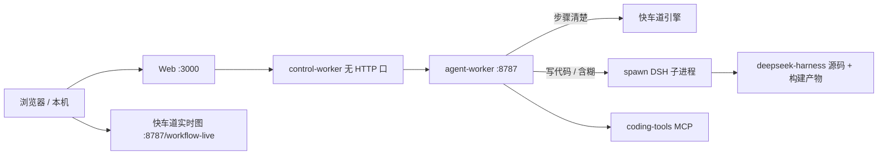

# 远程演示（Oracle）

实习演示机备忘，不是官方 quickstart。

本机：`ssh oracle`（`145.241.168.101`，用户 `ubuntu`）。  
远程目录：

| 仓库 | 路径 | 说明 |
|------|------|------|
| OpenRush（本仓库） | `/home/ubuntu/projects/open-rush` | Web / 队列 / agent-worker / 快车道 |
| DeepSeek Harness | `/home/ubuntu/projects/deepseek-harness` | 慢车道真正跑模型和工具的引擎，**不要改源码** |

DSH **没有自己的 8787/3000 端口**。`AGENT_RUNTIME=dsh` 时，agent-worker 按对话 spawn 子进程，用 JSON-RPC 说话。健康检查里 `"runtime":"dsh"` 就说明接到了。



打开：

- 聊天：http://145.241.168.101:3000
- 快车道图：http://145.241.168.101:8787/workflow-live
- 健康检查：http://145.241.168.101:8787/health
- 工具目录：http://145.241.168.101:8787/workflow-catalog

8799 只是本机端口被占时临时换过，仓库默认是 **8787**。

---

## 什么进 Git，什么不要拷到机器上

测试源码要进 GitHub，用来自证。演示机不跑 vitest，不必把测试、覆盖率、密钥、构建产物拷过去。

| 类别 | 进 GitHub | 拷到演示机 |
|------|-----------|------------|
| 业务源码（`packages/`、`apps/*/src`） | 要 | 要（`git pull`，或按 `deploy.ignore` 热修） |
| 单测 `**/__tests__`、`*.test.ts` | **要** | **不要** |
| `coverage/`、`test-results/`、`.next/`、`dist/`、`node_modules/` | 不要 | 不要，机器上自己装、自己编 |
| `.env.local`、密钥 | 不要 | 机器上留一份，不要 scp 覆盖 |
| worker 根目录误写的 `css/` `js/` `index.html` | 不要 | 不要 |

排除名单：仓库根目录 `deploy.ignore`。误生成的静态页已写进 `.gitignore`。

应急热修（还没 commit）在仓库根目录：

```bash
rsync -az --exclude-from=deploy.ignore ./ oracle:/home/ubuntu/projects/open-rush/
```

常规做法：先 commit / push，远程 `git pull --ff-only`。远程工作区里 scp 过的脏文件，一 pull 可能被冲掉，要留的改动先提交。

---

## 机器上要有什么

- Node 22、pnpm、Postgres、Redis（这台没走 Docker Desktop）
- `uv` / `uvx` 在 `/home/ubuntu/.local/bin`。coding-tools MCP 的 `npx` 只是外壳，真正跑起来要 `uvx`。启动 worker 时 PATH 里必须有它，否则 catalog 里没有 `coding-tools__*`
- 快车道搜仓库时用整份 open-rush，不要用空的项目工作区。写在 `apps/agent-worker/.env.local`：

```
WORKFLOW_WORKSPACE=/home/ubuntu/projects/open-rush
```

不要设 `CODING_TOOLS_MCP=0`。没高德 Key 就走出游假数据，这是预期。

---

## DeepSeek Harness 怎么部署

慢车道（聊天里写代码、问清楚、快车道失败回退）都靠它。演示机上已经有一份，新机器按下面做一遍。

1. **克隆到 OpenRush 的同级目录**（worker 默认找 `../deepseek-harness`）：

```bash
cd /home/ubuntu/projects
git clone https://github.com/deepseek-ai/deepseek-harness.git
cd deepseek-harness
pnpm install
pnpm run build
```

构建成功后应能看到 `packages/examples/jsonrpc-demo/lib/packaged-bin.js`（或 `lib/bin.js`）。  
OpenRush 真正拉起的入口是本仓库的 `apps/agent-worker/dsh/launch.mjs`，组合配置是同目录 `cordis.yml`。`launch.mjs` 要求环境变量 `DSH_ROOT` 指向这份 checkout，插件才解析得到。

2. **只改 OpenRush 的 `apps/agent-worker/.env.local`，不要改 DSH 源码：**

```
AGENT_RUNTIME=dsh
DSH_ROOT=/home/ubuntu/projects/deepseek-harness
DSH_MODEL=DeepSeek-V4-Flash-INT8
DEEPSEEK_API_KEY=...
DEEPSEEK_BASE_URL=https://你的网关/aigw/v1
```

网关若是自签证书才需要 `NODE_TLS_REJECT_UNAUTHORIZED=0`。  
`DSH_ROOT` 可以省略——只要目录就在 `open-rush` 隔壁并已 build。演示机上写死了绝对路径，避免 cwd 不对时找不到。

3. **不要单独 `systemctl start dsh`。** 起 agent-worker 即可。一场对话复用同一个 DSH 进程，闲置大约半小时再回收。`GET /health` 应带 `"runtime":"dsh"`。

DSH 升级（一般不用，升级可能和 `cordis.yml` 对不上）：

```bash
cd /home/ubuntu/projects/deepseek-harness
git pull
pnpm install
pnpm run build
# 然后重启 agent-worker，让新 spawn 用到新构建
```

---

## 更新代码之后怎么重启

```bash
ssh oracle
export PATH="$HOME/.local/bin:$PATH"
cd /home/ubuntu/projects/open-rush
git pull --ff-only origin main
pnpm --filter @open-rush/mcp --filter @open-rush/workflow --filter @open-rush/agent-runtime --filter @open-rush/agent-worker --filter @open-rush/control-plane --filter @open-rush/control-worker build
# Web 用 pnpm dev，一般不用单独 build
```

停旧进程（只杀监听口，别误杀当前脚本）：

```bash
# 8787 = agent-worker；3000 = next
for p in 8787 3000; do
  pid=$(ss -tlnp | sed -n "s/.*:$p .*pid=\\([0-9]*\\).*/\\1/p" | head -1)
  [ -n "$pid" ] && kill "$pid"
done
pkill -f "apps/control-worker/dist/worker.js" || true
```

再起：

```bash
cd /home/ubuntu/projects/open-rush/apps/agent-worker
setsid nohup env PATH="$HOME/.local/bin:$PATH" \
  node --env-file=.env.local dist/server.js >> /tmp/agent-worker.log 2>&1 < /dev/null &

cd /home/ubuntu/projects/open-rush/apps/control-worker
setsid nohup node --env-file=.env.local dist/worker.js >> /tmp/control-worker.log 2>&1 < /dev/null &

cd /home/ubuntu/projects/open-rush/apps/web
setsid nohup pnpm dev -p 3000 >> /tmp/web.log 2>&1 < /dev/null &
```

确认：

```bash
curl -sS http://127.0.0.1:8787/health
curl -sS http://127.0.0.1:8787/workflow-catalog
# coding 应为 true，工具里有 coding-tools__search_text
```

日志：`/tmp/agent-worker.log`、`/tmp/web.log`、`/tmp/control-worker.log`。  
看到 `coding-tools MCP connected` 才算 MCP 起来了。

---

## 常见坑

- **健康检查不是 dsh**：`"runtime":"dsh"` 只说明 worker 会去 spawn；真连上要看聊天能否出思考/工具，或 worker 日志里有没有 DSH 子进程。缺 `DSH_ROOT` 或没 `pnpm run build` 时，慢车道会直接报 `DeepSeek Harness runtime is not ready`。
- **整页连不上**：多半是 rebuild 那几秒 8787 空了，等 health 200 再刷。
- **搜 chooseLane 却走网页搜**：catalog 里没有 coding-tools。查 PATH 有没有 `uvx`，有没有误开 `CODING_TOOLS_MCP=0`。
- **`arguments.path is required`**：规划器读文件时没等搜索结果。新代码会补依赖；仍失败就看图里 `read_file` 是否和 `search_text` 同一波。
- **侧栏叫 echo-bot**：那是演示 Agent 的名字，不是工作流。库里已改成 OpenRush，刷新页面。
- **本机 git push 要代理**：agent 进程没有系统代理时，用本机 Clash mixed-port，例如 `https_proxy=http://127.0.0.1:7897`。
